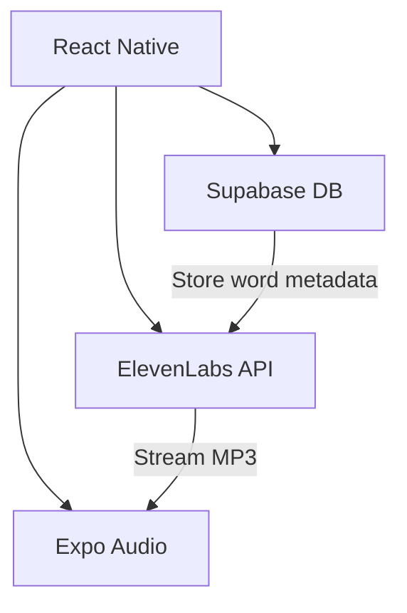

import Project from '@/components/Project.astro'

export const pageData = {
  title: "WDYK - AI-Powered Spelling Tutor",
  description: "A mobile app blending React Native animations with AI voice synthesis to make spelling practice engaging. Built to master Expo workflows and real-time data sync.",
  tags: [
    "React Native",
    "Expo SDK",
    "Supabase",
    "ElevenLabs API",
    "Animated API",
    "EdTech Experiment"
  ],
  coverImageSrc: "/projects/wdyk-hero.jpg",
  imageAlt: "WDYK app showing voice waveform and spelling UI",
  tagline: "Where AI voices meet mobile-first learning",
  challenges: [
    "Syncing ElevenLabs API latency with UI feedback",
    "Offline-first audio caching",
    "Cost-effective voice synthesis"
  ]
}

<Project {...pageData} />

## Project Goals: Learning Through Building

As a web developer expanding into mobile, I aimed to:
1. Master React Native core concepts
2. Implement complex touch interactions
3. Solve real device compatibility issues
4. Ship to TestFlight/Play Store

**Why a Spelling App?**  
Perfect for testing:
- Audio playback timing
- Instant visual feedback
- Progress tracking across sessions


## Technical Deep Dive

**Tech Stack Choices**
- React Native: Cross-platform efficiency
- Expo: Accelerated development cycle
- Reanimated: 60fps animations
- Backend: Supabase
- AI: ElevenLabs API for voice & OpenAI for words suggestions
- Animation sequence breakdown

**Challenges & Lessons Learned**
- Audio Latency Issues
  Problem: Pronunciation playback delayed on low-end devices
  Solution: Pre-cache assets and use Expo’s Sound object pooling

- Animation Jank
  Problem: Frame drops during tile movements
  Solution: Switch from JS-driven to Reanimated’s native threads

**What I’d Do Differently**
- Use TypeScript more rigorously
- Add error boundaries earlier

**Results & Next Steps**
- Implemented complex ui
- Expanded my knolwedge on mobile animation
- Write an Learnings
- Try to successfully published to play store
- Try animation consistency across devices
- Master Expo EAS build system


**Future Experimentation Ideas**
- Add multiplayer mode via WebSockets
- Implement ML-based difficulty scaling
- Create teacher dashboard with React Native Web

Want the Code?
This project is open source - perfect for:

- React Native beginners
- Educators wanting to customize
- Mobile devs curious about Expo
- Explore Codebase


### Architecture


### Technical Deep Dive
```typescript
// Generate and cache pronunciation
const generateAudio = async (word: string) => {
  const { data } = await supabase
    .from('words')
    .select('audio_url')
    .eq('word', word);

  if (!data?.length) {
    const aiAudio = await elevenlabs.generate({ text: word });
    await supabase.storage.upload(`audios/${word}.mp3`, aiAudio);
  }
};
